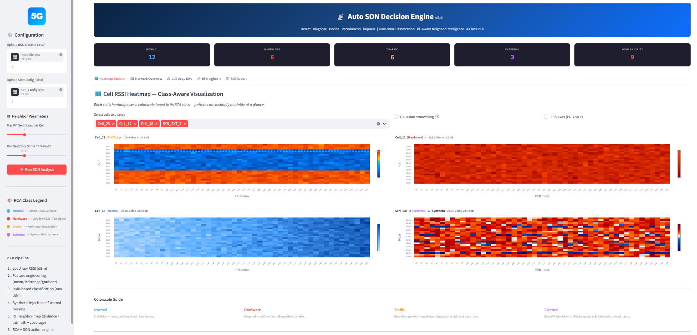
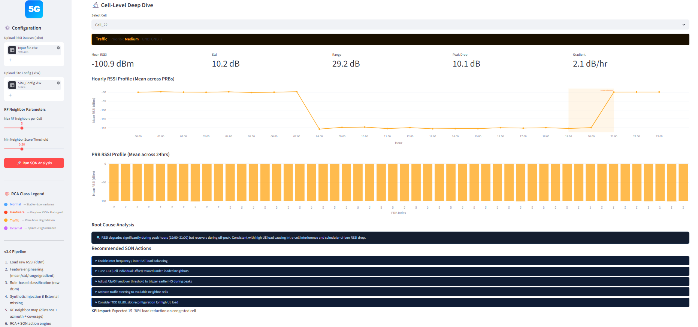

# telecom-interference-classifier

> Auto SON (Self-Organising Network) Decision Engine for 5G/LTE interference classification — detects and classifies cell anomalies from raw RSSI data using a rule-based engine with RF-aware neighbour intelligence, and presents results through an interactive Streamlit dashboard.

---

## Screenshots

| Network Overview & Heatmap | Cell Deep Dive & RCA |
|---|---|
|  |  |

---

## Features

- **4-Class Interference Classification** — Normal, Hardware Fault, Traffic Congestion, External Interference — using raw dBm signal features
- **Rule-Based Engine (v3)** — telecom-realistic thresholds applied directly on raw dBm values (no ML bias from normalization)
- **Engineered Features** — mean RSSI, std, range, peak-drop, temporal gradient, peak Z-score computed per cell
- **RF-Aware Neighbour Selection** — neighbours ranked by composite score (distance + azimuth alignment + coverage beam match)
- **Synthetic External Injection** — if no External class is present in the dataset, realistic synthetic interference cells are generated to guarantee all 4 classes
- **SON Action Recommendations** — prioritised field actions and KPI impact estimates per class
- **Interactive Streamlit Dashboard** with 5 tabs:
  - 🗺️ **Heatmap Explorer** — class-aware RSSI heatmaps per cell (24h × 50 PRB)
  - 📊 **Network Overview** — fleet-wide classification distribution and priority breakdown
  - 🔬 **Cell Deep Dive** — per-cell feature analysis, RCA narrative, and SON actions
  - 🔗 **RF Neighbours** — RF-scored neighbour map with distance, azimuth, coverage match
  - 📋 **Full Report** — downloadable Excel report of all cells

---

## Architecture

```
telecom-interference-classifier/
├── son_dashboard_v3.py   # Streamlit dashboard (v3 — current)
├── son_engine_v3.py      # Core engine: features, rules, RCA, SON actions (v3 — current)
├── son_dashboard_v2.py   # Previous dashboard version (reference)
├── son_engine_v2.py      # Previous engine version (reference)
├── Input_file.xlsx       # RSSI input data (24h × 50 PRBs per cell)
├── Site_Config.xlsx      # Cell site configuration (lat, lon, azimuth, beamwidth)
├── requirements.txt
└── .gitignore
```

### Engine Pipeline (`son_engine_v3.py`)

```
Load RSSI Excel
      │
      ▼
Feature Engineering  ──→  mean, std, range, peak_drop, mean_gradient, peak_zscore
      │
      ▼
Rule-Based Classification (raw dBm thresholds)
      │
      ├─ Hardware  :  mean < −108 dBm  AND  std < 3.5 dB  (flat dead signal)
      ├─ Traffic   :  peak_drop 5–20 dB  AND  std ≥ 5 dB  AND  peak_zscore < −0.5
      ├─ External  :  std ≥ 5 dB  AND  range ≥ 18 dB  AND  gradient ≥ 2 dB/hr
      └─ Normal    :  all else
      │
      ▼
RF-Aware Neighbour Map  ──→  score = 0.3×distance + 0.3×azimuth + 0.4×coverage
      │
      ▼
Cosine Similarity with RF Neighbours
      │
      ▼
RCA Narrative + SON Actions + Priority
      │
      ▼
Report DataFrame  ──→  Excel export / Streamlit display
```

### Classification Classes

| Class | Key Signal Pattern | Priority |
|---|---|---|
| **Normal** | Mean RSSI −83 to −97 dBm, low variance (std < 4 dB) | Low |
| **Hardware** | Mean < −108 dBm, flat signal (RF chain dead, RRU/feeder fault) | High |
| **Traffic** | Peak-hour RSSI drop 5–20 dB at 19:00–21:00, moderate variance | Medium |
| **External** | High variance (std ≥ 5 dB), large range (≥ 18 dB), irregular bursts | High |

### RCA Narratives & SON Actions

**Hardware Fault**
- Dispatch field engineer; inspect feeder cable, VSWR, RRU/AAU, antenna

**Traffic Congestion**
- Enable load balancing; tune CIO, A3/A5 handover thresholds; activate traffic steering

**External Interference**
- Spectrum scan to identify source; ICIC policies; frequency re-farming; PIM inspection

---

## Data Format

### `Input_file.xlsx`

| Column | Description |
|---|---|
| `Cell_Name` | Unique cell identifier |
| `GNB_ID` | gNodeB identifier |
| `Hour` | Hour of day (0–23) |
| `PRB_0` … `PRB_49` | Raw RSSI values in dBm for each Physical Resource Block |

Each cell contributes 24 rows (one per hour), resulting in a 24 × 50 RSSI matrix per cell.

### `Site_Config.xlsx`

| Column | Description |
|---|---|
| `Cell_Name` | Cell identifier (join key) |
| `Latitude` | Site latitude (decimal degrees) |
| `Longitude` | Site longitude (decimal degrees) |
| `Azimuth` | Antenna azimuth (degrees, 0–360) |
| `Beamwidth` | Horizontal beamwidth (degrees) |

---

## Setup & Installation

### Prerequisites

- Python 3.12+
- pip

### 1. Clone the Repository

```bash
git clone https://github.com/<your-username>/telecom-interference-classifier.git
cd telecom-interference-classifier
```

### 2. Install Dependencies

```bash
pip install -r requirements.txt
```

### 3. Run the Dashboard

```bash
streamlit run son_dashboard_v3.py
```

Open your browser at `http://localhost:8501`.

The dashboard auto-loads `Input_file.xlsx` and `Site_Config.xlsx` from the same directory. Use the sidebar file-path inputs to point to custom data files.

### 4. Run the Engine Standalone

```bash
python son_engine_v3.py
```

This prints a classification summary to the console and saves `SON_Report_v3.xlsx` in the working directory.

---

## Usage

### Dashboard Tabs

1. **🗺️ Heatmap Explorer** — Select any cell from the sidebar; view its 24h × 50-PRB RSSI heatmap with a class-specific colorscale and anomaly annotations.
2. **📊 Network Overview** — Pie chart of class distribution, priority bar chart, and fleet-wide KPI summary cards.
3. **🔬 Cell Deep Dive** — Select a cell to view its extracted features, RCA narrative, prioritised SON action checklist, and predicted KPI impact.
4. **🔗 RF Neighbours** — Explore the RF-scored neighbour table (distance, azimuth diff, coverage match, composite score) and neighbour RSSI comparison.
5. **📋 Full Report** — Sortable/filterable table of all cells with download button for Excel export.

### Sidebar Controls

- **RSSI File path** — path to `Input_file.xlsx` (default: current directory)
- **Site Config path** — path to `Site_Config.xlsx`
- **Top N RF Neighbours** — number of neighbours per cell (default: 5)
- **Min Neighbour Score** — minimum composite RF score to include a neighbour (default: 0.3)
- **Cell selector** — choose a specific cell for Heatmap and Deep Dive tabs

---

## Dependencies

| Package | Purpose |
|---|---|
| `streamlit` | Web UI framework |
| `pandas` | Data manipulation |
| `numpy` | Numerical computation |
| `plotly` | Interactive charts and heatmaps |
| `scikit-learn` | Cosine similarity computation |
| `scipy` | Gaussian filter for heatmap smoothing |
| `openpyxl` | Reading/writing `.xlsx` files |

---

## Version History

| Version | File | Key Changes |
|---|---|---|
| v3 (current) | `son_engine_v3.py` / `son_dashboard_v3.py` | Raw dBm classification, class-specific colorscales, synthetic External injection, cleaner layout |
| v2 (reference) | `son_engine_v2.py` / `son_dashboard_v2.py` | Earlier implementation |

---

## License

This project is provided for educational and demonstration purposes.
